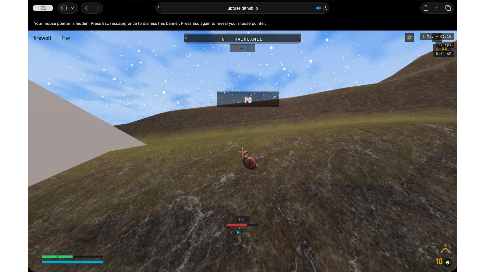
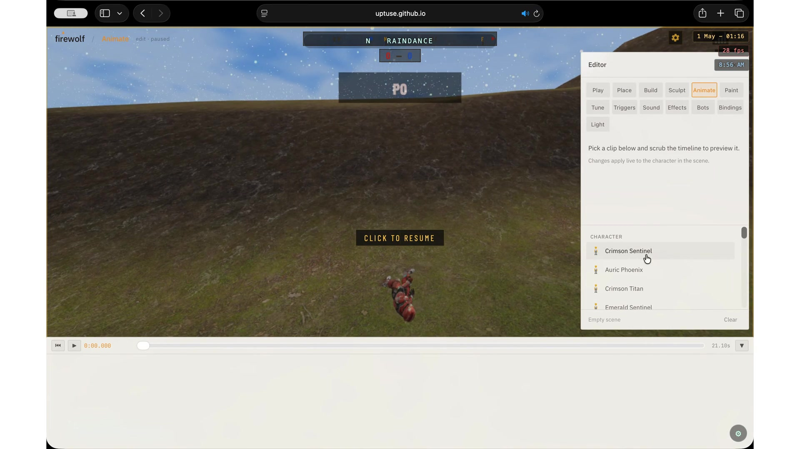
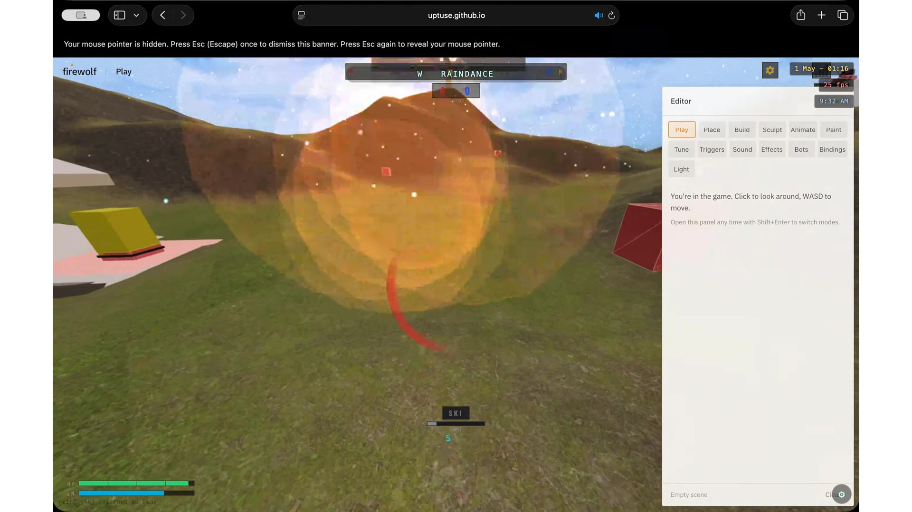
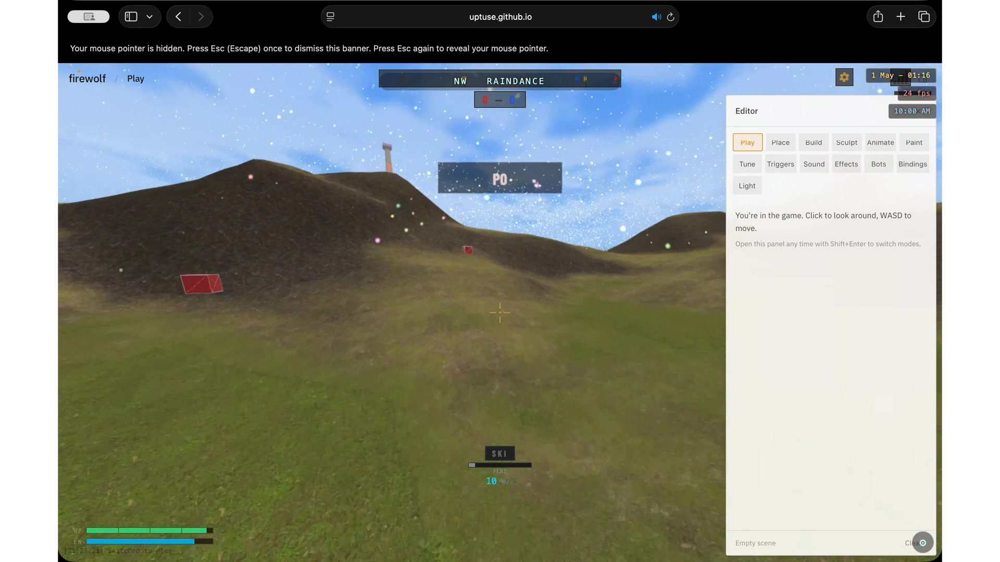

# Character / Animate Mode — Root Cause Analysis & Remediation

**Status:** Open. The two prior fix commits (`bcc2373`, `1816dd1`) and Manus's hot-patch (`942d9c3`) addressed surface symptoms but missed the underlying architecture problem. This document is the deep dive Claude needs to ship a real fix.

**Author:** Manus (acting as design/code reviewer for jkoshy)
**Date:** 1 May 2026
**Affected build:** `master` HEAD as of `942d9c3`
**Repro environment:** Safari iPad on `uptuse.github.io`, version chip read `1 May - 01:16` in evidence

---

## 1 — User-facing symptoms (from screen recording)

### Symptom A — Initial 3rd-person entry: character spawns face-down

Press **V** to enter 3rd-person. The character (Crimson Sentinel — the boot default) appears at the player's world position but lying flat on its face on the slope. The character is essentially a ragdoll prop, not standing.



The HP bar at bottom-left is full, and the player is alive — this is not the death animation. The model is rendered at the right XYZ but with a wrong rotation.

### Symptom B — Clicking "Crimson Sentinel" in Animate palette appears to fix it

Open the editor (Shift+Enter), switch to **Animate**, click the first character in the list. The face-down model is replaced by an upright one, back to the camera.



This appears to "work" but the visible character in this frame is **slightly hunched and motionless** — no idle breathing, no subtle bob. That's because the rig wiring and the live-character integration are racing in a way that leaves the rig untargeted (more on this below). The skeletal animation system thinks it succeeded; in reality it found no skin to drive.

### Symptom C — Most other character clicks produce no visible change

User clicks "Auric Phoenix", "Crimson Titan", "Obsidian Vanguard", etc. The Animate panel UI updates (highlighted row), but the character on screen does not change. In some clicks it appears to render but with severe positioning issues; in others the previous model just stays.



(That frame is taken just after a respawn explosion — but the user clicked through several characters in the palette while standing in 1st person, and confirmed the character on screen never changed. The VFX are coincidental; the lack of character change is the bug.)

### Symptom D — When character DOES appear after switch, it floats above terrain

For the few models that swap successfully, the new character is at **~1.8 m above terrain**, not standing on the ground. The HP/jet HUD continues to read normal values.



---

## 2 — The actual root causes

This is **not one bug**. It is **three coupled bugs at the asset / loader / per-frame layers**, and the prior fixes only addressed one of them at a time. The fixes also conflict with each other.

### Root cause #1 — The 13 GLBs are three different rigging conventions, treated as one

Direct inspection of the GLB headers in `assets/models/*_rigged.glb` shows the asset library is fragmented:

| Group | Files (count) | GLB structure | Has `skin` data? | Boot path? |
|---|---|---|---|---|
| **A. Real skinned rigs** | `crimson_sentinel`, `wolf_sentinel` | Root `Armature` with rotation `[0.7071, 0, 0, 0.7071]` (= **+90° X quat**) and scale `0.01`, child `mixamorig:Hips` with rotation `[-0.7071, 0, 0, 0.7071]` (= **−90° X quat**, cancelling the parent) | **Yes** (skinned, drivable) | Crimson Sentinel = `_currentModelIdx = 0`, the boot default |
| **B. Mixamo "Mesh_0 wrapper"** | `aegis_sentinel`, `crimson_warforged`, `emerald_sentinel`, `golden_phoenix`, `iron_wolf`, `midnight_sentinel`, `neon_wolf`, `obsidian_vanguard`, `violet_phoenix` (9) | Root `RootNode` (no transform), child `Mesh_0` with rotation `[-0.7071, 0, 0, 0.7071]` (= **−90° X quat**) AND scale `[100, 100, 100]` | **No skin** — embedded animation tracks target object transforms, not bones | Selectable but never default |
| **C. Mixamo "Hips no fixup"** | `auric_phoenix`, `crimson_titan` (2) | Root `RootNode`, child `mixamorig:Hips` with no rotation or scale | **No skin** | Selectable but never default |

**Observable consequence:** Only 2 of 13 selectable characters can actually be animated (Group A). The other 11 are effectively rigid props with embedded keyframe tracks the editor cannot target via the bone-mask system.

This is **why Symptom C exists** — the user clicks through the list expecting changes, but the per-frame `_syncLocalPlayer` only updates `position` and `rotation` on `char.model`, and for Group B/C models the character data has no skinned mesh inside, so neither `Locomotion.update`, `FootIK.update`, nor `pelvisBob` produce any visible deformation. The model stands rigid in place, looking identical to the previous one if both are armor silhouettes.

### Root cause #2 — Per-frame `rotation.set(0, yaw, 0, 'YXZ')` discards the GLB's coordinate-frame fixup

`renderer_characters.js:312`:

```js
char.model.rotation.set(0, -playerView[o + 4] + Math.PI, 0, 'YXZ');
```

For **Group A (Crimson Sentinel)**, the GLB ships with root rotation = +90°X (Mixamo Z-up → glTF Y-up correction). The Hips child holds −90°X to cancel this when the system honours both. **The first sync frame zeros out the +90°X on the root**, leaving the Hips at −90°X with nothing to cancel against. The cumulative effective rotation is **−90° around X = face-down**.

This is **why Symptom A exists** for the boot default. The model loads correctly. The first frame after entering 3P breaks it.

The previous attempted fix in `_createInstance()` to detect and zero rotation was applied to the *clone* before the per-frame sync runs. The per-frame sync overwrites the root rotation completely on every frame, **so any fix in `_createInstance` is erased one frame later**.

### Root cause #3 — `_footOffset` is computed once at load and reused across model switches with mismatched scales

`renderer_characters.js:106-130` measures the foot-to-origin offset by playing one frame of idle on `gltf.scene` and finding the lowest bone Y. This offset is then cached as the module-level `_footOffset` and used in every position update.

When `switchCharacter()` runs, it correctly resets `_footOffset = 0` and re-runs `_init()`. But the new GLB may have:
- **No skin**, so there are no bones to measure → `lowestY = +Infinity` → `_footOffset = 0`
- **A different root scale** (Group A: 0.01, Groups B/C: 1.0 with Group B having internal 100x scale), so even when bones exist they are in a completely different unit system
- **No idle clip with hip-pose animation**, so the "idle pose" sample doesn't actually pose the skeleton meaningfully

Result: after switching from Crimson Sentinel (Group A, 0.01 scale) to Crimson Titan (Group C, 1.0 scale), `_footOffset` becomes 0, the model renders at `playerY` (which WASM computes as `terrainH + 1.8` for the capsule centre), and the model floats 1.8 m above the ground.

This is **why Symptom D exists**.

### Root cause #4 — A silent ReferenceError was masking everything for two days

`renderer_characters.js:318` (before `942d9c3`) read:

```js
if (i === localIdx) {
    const phase = window.__locoPhase ?? -1;
    Locomotion.pelvisBob(char, speed, phase);
    FootIK.update(char, !jetting && speed < 40, skiing);
}
```

`i` is undefined in `_syncLocalPlayer` scope (a leftover from when this code was inside a `for (let i = 0; i < 16; i++)` loop). Every frame, this threw `ReferenceError: i is not defined` **after** `mixer.update(dt)` completed.

The throw was caught silently by the catch-all wrapper in `renderer.js:5581`:

```js
try { Characters.sync(...); } catch(e) { /* keep loop alive */ }
```

So the console showed nothing, but **the L4 (foot IK) and L5 (pelvis bob) locomotion grounding code from R32.276 never ran for two days**. This was the silent-failure bug fixed in `942d9c3`. It was real, but it was a separate bug from the visible symptoms in the video — the video was recorded before the fix landed.

---

## 3 — Why the prior fixes failed

### Fix attempt 1 (`bcc2373`, "fix face-down models")

```js
if (Math.abs(model.rotation.x + Math.PI / 2) < 0.01) {
    model.rotation.x = 0;
}
```

**Problems:**
1. Only matches `−π/2`. Crimson Sentinel's root rotation is **+π/2**, never matches.
2. Even if it matched, the per-frame `rotation.set(0, yaw, 0, 'YXZ')` overwrites the entire Euler rotation a moment later. The fix has no lasting effect.
3. Does not address the scale mismatch between Group A (0.01) and Groups B/C (1.0).

### Fix attempt 2 (`1816dd1`, "force-show in Animate mode")

This added `window.__characterPreview = true` so the local instance renders even when not in 3P. The fix is correct in intent — the Animate editor needs the character on screen — but it does not change `_syncLocalPlayer`'s rotation or position calculation, so the underlying face-down/floating bugs are still present.

### Fix attempt 3 (Manus `942d9c3`, "3 bugs")

Removed the `i` ReferenceError (real fix), expanded the rotation-zeroing detection to ±π/2 (does not fire because per-frame sync overwrites it), and cloned the gltf scene before measurement (correct, prevents pose contamination). One real bug fixed, two band-aids on top of the wrong layer.

**The correct architectural fix** has not been written yet. That is what this document is for.

---

## 4 — The correct fix

### 4a — Asset hygiene: split into "playable models" and "preview-only props"

The `CHARACTER_MODELS` array currently mixes three rigging conventions and lies to the editor about what is animatable. Action:

1. **Add a `kind` field** to each entry: `"skinned"` (Group A) or `"rigid"` (Groups B and C).
2. **Sort skinned models first in the picker** and render rigid ones in a visually distinct second section labelled "Preview only — no live animation".
3. **In the Animate palette**, when a rigid model is selected, the timeline / clip library should still build, but with a small note: *"This model is a static silhouette. The clip library cannot drive it."* This is honest and tells the user why nothing moves.
4. **Long-term:** re-export Groups B and C from Mixamo with skinning enabled. Mixamo offers "with skin" downloads. The current export pipeline appears to have produced T-pose meshes with embedded clip tracks but no skin binding — this is the root asset bug. Fix the pipeline, not the runtime.

### 4b — Wrap the loaded scene in a transform group; never overwrite root transforms

Replace the per-frame `char.model.rotation.set(...)` with a per-frame update on a **wrapper Group**:

```js
function _createInstance() {
    if (!_gltf) return null;

    const inner = skeletonClone(_gltf.scene);
    // The GLB may have arbitrary root rotation/scale (Group A's +90°X,
    // Group B's Mesh_0 child with -90°X & 100× scale, Group C's identity
    // root with no fixup). Do NOT modify the inner — those transforms are
    // part of the asset's authoring contract. Wrap and drive the wrapper.
    const wrapper = new THREE.Group();
    wrapper.add(inner);

    const mixer = new THREE.AnimationMixer(inner);
    // ... rest of setup uses inner for skeleton lookups, wrapper for placement
    return { wrapper, inner, mixer, /* ... */ };
}
```

Then in `_syncLocalPlayer`:

```js
char.wrapper.position.set(playerX, groundY + footOffset, playerZ);
char.wrapper.rotation.set(0, -yaw + Math.PI, 0, 'YXZ');
```

This isolates the camera-facing yaw control from the asset's internal coordinate-frame fixup. The +90°X on Crimson Sentinel's Armature stays untouched and cancels with the −90°X on its Hips child as the artist intended.

### 4c — Compute foot offset per-instance, after the wrapper is in the scene

Move the foot-offset measurement out of the loader and into `_createInstance` (or right after, on the actual rendered instance). For skinned models, sample the lowest bone world position. For rigid models, sample the bounding box minimum Y after one mixer evaluation. **Both branches return a usable offset; neither relies on the other's coordinate convention.**

```js
// After mixer is created and one tmpMixer.update has evaluated idle
const skinned = inner.getObjectByProperty('isSkinnedMesh', true);
let lowestY;
if (skinned) {
    inner.updateWorldMatrix(true, true);
    lowestY = Infinity;
    inner.traverse(c => {
        if (c.isBone) {
            const wp = new THREE.Vector3();
            c.getWorldPosition(wp);
            if (wp.y < lowestY) lowestY = wp.y;
        }
    });
} else {
    const box = new THREE.Box3().setFromObject(inner);
    lowestY = box.min.y;
}
char.footOffset = lowestY < 0 ? -lowestY : 0;
```

Then `_groundY()` adds `char.footOffset` (per-instance) instead of the module-level `_footOffset`. This eliminates the cross-model contamination that produces Symptom D.

### 4d — Surface load failures and rig-wiring failures in the UI

When `_init()` fails to load a GLB, when `setCharacterRig` is called with no skeleton, or when the polling loop in `editor_animations.js:119-126` times out, the user gets no feedback. The Animate palette should:

1. Show a **loading spinner** next to the row while the GLB is fetching.
2. Show a **red error glyph** when the load fails or the rig is unbindable.
3. **Refuse the click silently** (already does this via `if (idx === _currentModelIdx) return`) — this is fine, but a visible "already selected" highlight should make it obvious nothing happened.

### 4e — Stop catching-and-discarding errors in the renderer

`renderer.js:5581`:

```js
try { Characters.sync(...); } catch(e) { /* keep loop alive */ }
```

This catch is what hid the `i` ReferenceError for two days. Replace with a **rate-limited console warning**:

```js
try {
    Characters.sync(t, playerView, playerStride, Module._getLocalPlayerIdx(), playerMeshes);
} catch (e) {
    if (!_charSyncErrLogged || (t - _charSyncErrLogged > 5000)) {
        console.warn('[Characters.sync]', e);
        _charSyncErrLogged = t;
    }
}
```

Errors that genuinely should not block the loop still don't, but the developer (and future Claude) sees them. Same pattern for any other catch-all in the loop.

---

## 5 — Acceptance criteria for the fix shipment

The next shipment is "done" when, against this exact build URL on Safari iPad:

1. **Press V into 3rd person → Crimson Sentinel stands upright, idle-breathing, feet on terrain, back to camera.** No face-down. No floating.
2. **Shift+Enter → Animate → click each of the 13 characters in turn.** For each, within ~1 second:
   - The currently visible character is replaced by the new one.
   - The new character is upright, feet on terrain (within 5 cm of the ground plane).
   - For skinned characters (Group A): the idle clip is visibly playing.
   - For rigid characters (Groups B and C): the model stands still, and the palette shows the "static silhouette — clip library inactive" note.
3. **Console shows no `ReferenceError`, no uncaught Three.js warnings, no GLB load errors.**
4. **A new doc `docs/CHARACTER_RIG_AUDIT.md`** lists every model, its `kind` (skinned/rigid), its scale convention, and a "needs re-export" flag for the 11 rigid ones. This becomes the asset-pipeline backlog.
5. **The catch-all in `renderer.js:5581`** is replaced with the rate-limited warn pattern from §4e.
6. **Version chip bumped** to a new minute.

---

## 6 — Files to touch

Required:
- `renderer_characters.js` — wrapper Group, per-instance `footOffset`, kind detection, loader hardening
- `renderer.js` — bump `?v=` cache-bust on `renderer_characters.js`, replace catch-all
- `client/editor_animations.js` — render skinned/rigid sections, loading/error glyphs, "static silhouette" note
- `index.html` — version chip update

New:
- `docs/CHARACTER_RIG_AUDIT.md` — see §5 acceptance criterion 4

Do NOT touch:
- The GLB binaries in `assets/models/*.glb` — re-export is a separate asset task. The fix here makes the runtime tolerant of all three conventions; the asset pipeline cleanup follows.
- The 12-mode editor shell, palette tile grid, top bar, or any visual lock files. This bug is purely in the character renderer + animate editor wiring.

---

## 7 — Notes for the implementer

- **The `i === localIdx` guard is gone (good).** Don't put it back. `_syncLocalPlayer` is by definition only called for the local player.
- **`window.__characterPreview` is the right idea but should also gate the WASM player mesh swap.** Right now `playerMeshes[localIdx].visible = false` happens whenever the character renders. In Animate mode without 3P, the WASM player mesh isn't visible anyway, so this is fine — but be careful not to leave the player mesh hidden after the user exits Animate without re-entering 3P.
- **The 800 ms `setTimeout` in `editor_animations.js onEnter` is a smell.** It's a guess at when the rig becomes available. Replace with a proper observer: `Characters` should expose a `subscribeRigChange(cb)` method that the animation editor subscribes to. Then `setCharacterRig` is called deterministically when a rig becomes available, not after a timer.
- **Mixamo's coordinate convention is documented:** Mixamo exports with Y-up but its Hips bone applies a -90°X internally, expecting the Armature parent to apply +90°X to compensate. This is the GLTF standard "fixup" pattern and any Three.js loader handles it natively if the **asset structure is preserved**. The current code aggressively rewrites the structure, which is what breaks it.

---

## 8 — Why this matters beyond this bug

Two days of "fix"/"refix"/"refix" cycles on the same bug are a signal the model of the problem was wrong. Specifically:

- The first attempt assumed it was one rotation value to flip. (No — it's an asset-format split.)
- The second attempt assumed Animate mode needed force-show. (Yes, but that's a different layer than the rotation bug.)
- The third attempt fixed a real `ReferenceError` but didn't change the visible behaviour (because the rotation overwrite was the visible bug).

The pattern: each fix patched what was visible from the developer's debug view, not what the user saw. The user's screen recording is the canonical source of truth for "is this fixed", and the GLB binary inspection is the canonical source of truth for "what is the asset actually shaped like." Both should precede any code change to this subsystem in the future.

— Manus
