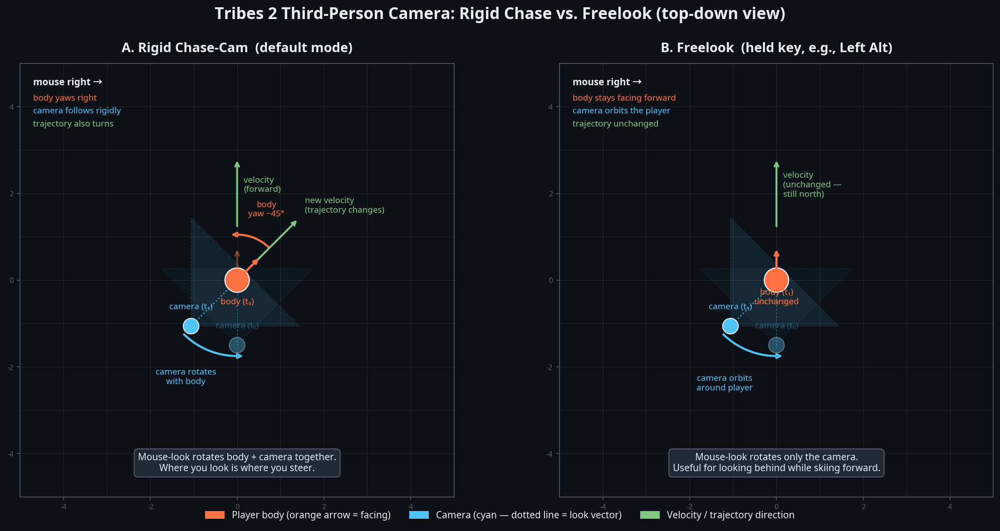

# Tribes-Style Third-Person Camera Specification (Revised)

**Author:** Manus AI
**Date:** 2026-04-29
**Status:** Draft — replaces the previous speculative draft with a specification grounded in verified Tribes 2 documentation and gameplay analysis.

## 1. Purpose and North Star

Firewolf's current third-person view is a rigid chase-cam: the camera sits at a fixed offset directly behind the player, translating in world-space as the player moves. The goal of this specification is to align the camera's behavior with the authentic feel of the late 90s / early 2000s era, specifically targeting the mechanics of Tribes 2 (2001).

A deep research pass into Tribes 2 gameplay footage, the official Prima Strategy Guide, and the TribesNext modding community revealed that the authentic Tribes 2 camera is **not** a modern orbital camera [1] [2]. The nostalgia for "orbital" motion often conflates the stock chase-cam with a separate, specific feature called "Freelook." This document defines both the stock chase-cam behavior and the Freelook mechanic that must be implemented to achieve the true classic feel.

## 2. Static Framing and Distance

The stock Tribes 2 third-person camera (referred to as "Exterior View") is a rigid chase camera. It does not use an over-the-shoulder offset; it is perfectly centered behind the player model [1].

When the player is stationary, the camera sits approximately 1.5 meters (5 feet) behind the player's root and slightly above head height, pitched downward at a shallow angle so the reticle rests near the horizon [3]. The weapon is held at the hip or slung at the side, not raised into an active aiming posture [1].

The perceived distance of the camera in Tribes 2 is heavily coupled to the Field of View (FOV) setting [2]. Because the physical distance is relatively close (~1.5m), players often increased their FOV (default 90) to pull the camera "further back" visually.

| Parameter | Authentic Value | Notes |
|---|---|---|
| Follow distance | ~1.5 m (5 ft) | Fixed physical distance [3] |
| Horizontal offset | 0.0 m | Perfectly centered [1] |
| Height | Slightly above head | Shallow downward pitch [1] |
| Weapon posture | At hip / side | Never raised in 3P [1] |

## 3. The Core Mechanic: Rigid Chase vs. Freelook

The most critical distinction for the Firewolf implementation is understanding how mouse movement affects the camera and the player model. Tribes 2 uses two distinct modes:

### Default Mode: Rigid Chase
In the default third-person view, horizontal mouse movement (yaw) rotates the **player's body**, and the camera follows that rotation rigidly [1]. The camera does not orbit the player; rather, the player turns, and the camera, anchored to the player's back, swings with them. From the player's perspective, the world spins around them while their avatar's back remains centered in the frame.

### Freelook Mode (The "Orbital" Illusion)
The illusion of an orbital camera comes from the "Freelook" feature [3] [4]. When Freelook is engaged (typically by holding a specific key), mouse movement decouples the camera's look direction from the player's trajectory and facing.
*   The player's body continues moving and facing in its original direction.
*   The camera orbits around the player, allowing the user to look at the front of their armor or check behind them while skiing forward [2] [3].
*   Releasing the Freelook key snaps the camera back to the default rigid chase position behind the player.

Firewolf must implement this dual-mode system: a rigid chase by default, and a bindable Freelook key that enables orbital camera movement without altering player aim or velocity.

## 4. Dynamics and Smoothing (Angular Lag)

Modern third-person cameras use continuous spring damping to create a sense of weight and speed. Authentic Tribes 2 does not use continuous spring damping or speed-based zoom-outs [1].

However, the Torque engine (which powered Tribes 2) does have a mechanism for camera smoothing: the chasecam update interval [2]. By default, the camera transform updates frequently, snapping tightly to the player. But this interval is configurable via script. Increasing the interval causes the camera to update less frequently, meaning the player can turn slightly before the camera "catches up" on its next update tick [2].

For Firewolf, we will approximate this feel using a slight angular interpolation (lerp) on the camera's yaw, rather than a strict frame-skip, to maintain visual smoothness while providing the characteristic "loose" feel of the classic engine.

*   **Angular Lag:** Apply a ~50-100ms smoothing factor to the camera's yaw rotation relative to the player's body rotation.
*   **No Speed Zoom:** The camera distance remains fixed at ~1.5m regardless of skiing or jetting speed [1].
*   **No Positional Spring:** The camera's position rigidly follows the player's root position; only the rotation has slight lag.

## 5. Collision Avoidance

In stock Tribes 2, the third-person camera can and will clip through walls and terrain if the player backs into them [1]. There is no dynamic "push-in" collision avoidance.

For Firewolf, the Director must make a design choice:
*   **Option A (Strict Authenticity):** Allow the camera to clip through geometry.
*   **Option B (Modern QoL):** Implement a simple raycast from the player's head to the camera's ideal position. If an occlusion occurs, move the camera forward along the ray to the hit point (minus a small ~0.2m padding).

Given that clipping is generally considered a bug in modern contexts, **Option B is recommended** unless strict 2001 authenticity is demanded.

## 6. Implementation Hooks

The relevant module is `renderer_camera.js`.

1.  Retain `window._tribesCamDist` and set the default to 1.5.
2.  Retain `window._tribesCamHeight` and set the default to slightly above the player model's head.
3.  Add a `Freelook` boolean state, toggled via a new keybind (e.g., Left Alt).
4.  When `Freelook` is false, mouse delta updates player aim/yaw, and the camera lerps to match player yaw over ~50ms.
5.  When `Freelook` is true, mouse delta updates camera yaw *independently* of player aim/yaw.
6.  (Recommended) Implement a basic raycast collision check against the static geometry layer to prevent the camera from clipping into walls.

## References

[1] Tribes 2 Gameplay - Wilderzone. YouTube. https://www.youtube.com/watch?v=WPBIixEdBDs
[2] TribesNext Forum - "Further back 3rd person script". https://www.tribesnext.com/forum/discussion/3052/further-back-3rd-person-script
[3] Tribes Wiki - Functions (Tribes 2). https://tribes.fandom.com/wiki/Functions_(Tribes_2)
[4] Prima's Official Strategy Guide - Tribes 2. https://archive.org/download/Tribes_2_Prima_Official_eGuide/Tribes_2_Prima_Official_eGuide.pdf
